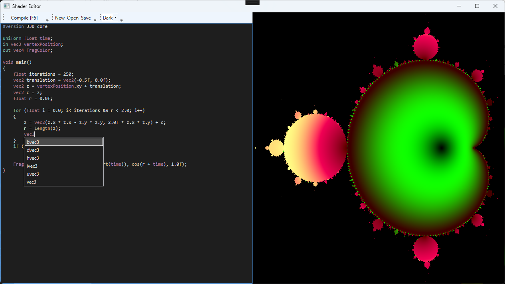

# Shader IDE

Just a fun project for me to mess around with some OpenGL and C#, in order for me to have
a smoothing experience experimenting with some OpenGL shadering, and in the process also 
implemented some IDE features, such as syntax highlighting and a suggestion popup menu.

## Currently implemented:

- Syntax highlighting using WPF RichTextBox
- Suggestion options using WPF Popup
- Syntax/Suggestion list are implemented using a simple OpenGL keyword list

## Preview

